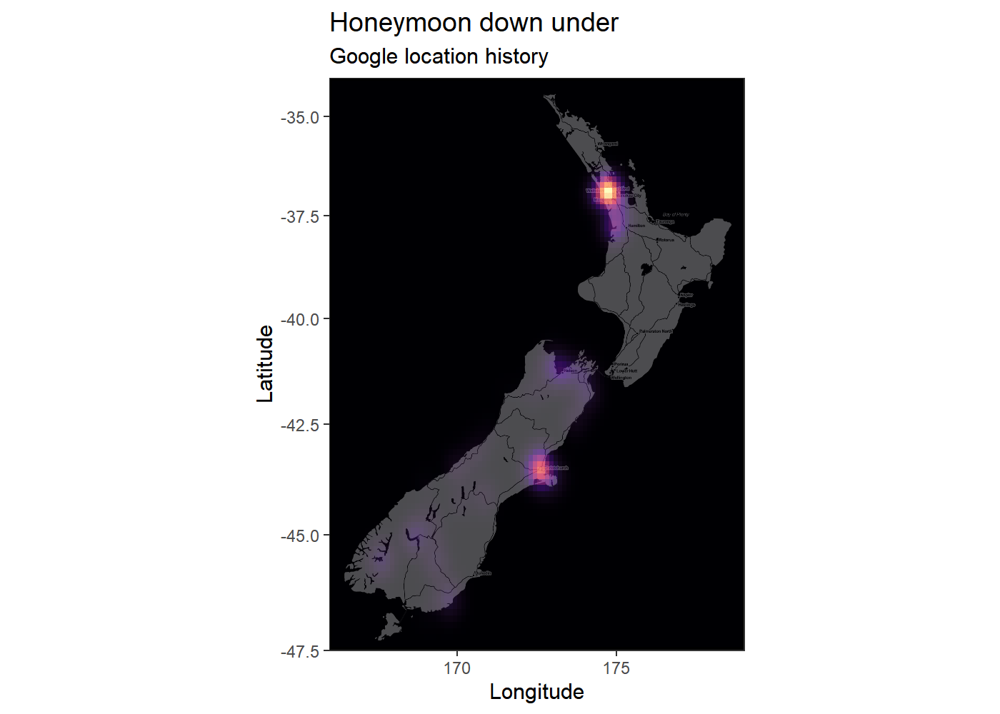

Visualising Google location data in R
================

Having a go at visualising my Google location history data with R. It’s
not perfect.

## Required packages

``` r
library(rjson) # The google location history file is a JSON 
library(ggmap) # For ggplot2 background layer maps
library(tidyverse) # For ease of data wrangling
library(lubridate) # For date manipulation
```

## Data in

Read the raw json

``` r
raw <- fromJSON(file='Takeout/Location History/Location History.json')
```

## Data wrangling

Extract the fields I require from the raw JSON.

``` r
# Flatten the raw JSON file
flat <- flatten(flatten(raw))

# Extract the timestamp, lat, long and accuracy data
ts <- flat[names(flat) == "timestampMs"] %>% unlist() %>% unname()
lat <- flat[names(flat) == "latitudeE7"] %>% unlist() %>% unname()
lon <- flat[names(flat) == "longitudeE7"] %>% unlist() %>% unname()
acc <- flat[names(flat) == "accuracy"] %>% unlist() %>% unname()
```

Create a dataframe containing all records and add new variables.

``` r
df <- 
  tibble(ts=ts, lat=lat, lon=lon, acc=acc) %>%
  mutate(myts = as_datetime(as.numeric(ts)/1000)) %>% # Convert raw timestamp to datetime
  arrange(myts) %>% 
  mutate(year = year(myts),
         month = month(myts, label=T),
         lat = lat / 1e7, # I think these need to be divided by 1e7
         lon = lon / 1e7, # I think these need to be divided by 1e7
         xstart = lon, # Create start and end columns for plotting segments later on
         xend = lead(lon), 
         ystart = lat, 
         yend = lead(lat),
         dist = (((xend - xstart)^2) + ((yend - ystart)^2))^0.5) # Create a distance column (pythagoras)
```

## Get map data

Get coordinates of the box that surrounds New Zealand. I found this
website <http://bboxfinder.com> which was useful for this.

``` r
nz_box <- c(left= 166, right=179, bottom=-47.5, top=-34)

# Assign Christchurch and Auckland airport coordinates
chc <- c(172.5369, -43.4864)
akl <- c(174.7850, -37.0082)
```

Get map using ggmap(). Here I have saved the map locally and load it in
the building of this markdown document - hence the commented out lines.

``` r
# nz_map <- get_stamenmap(bbox = nz_box, maptype = "toner-lite", zoom=7)
# save(nz_map, file="nz_map_stamen_tonerlite_zoom7.Rdata")
load(file="nz_map_stamen_tonerlite_zoom7.Rdata")
```

### Reduce location data

As the raw JSON contains all of my location history data, here I reduce
it to just records within the New Zealand bounding box. I also filter to
records where the distance between points is less than 5 - this means
segment lines are not drawn between points that are very far apart (such
as the internal flight from Christcjurch to Auckland)

``` r
nz_df <- 
  df %>%
  filter(between(lon, nz_box[1], nz_box[2]),
         between(lat, nz_box[3], nz_box[4])) %>% 
  filter(dist < 5)
```

## Visualise

``` r
ggmap(nz_map) + 
  geom_point(data = nz_df, aes(lon, lat, col=as.numeric(myts), size=acc))+
  geom_segment(data = nz_df, aes(x=xstart, xend=xend, y=ystart, yend=yend))+
  geom_segment(aes(x=chc[1], y=chc[2], xend=akl[1], yend=akl[2]), lty=2)+ # Add flight segment
  scale_color_viridis_c(option="plasma", breaks=as.numeric(range(nz_df$myts)),
                        labels=format(range(nz_df$myts), "%d %b %Y"))+
  scale_size(range=c(1.5,6), guide = FALSE)+
  theme_bw()+
  theme(legend.position = c(0.21, 0.85),
        legend.background = element_rect(fill=NA),
        legend.text = element_text(size=8))+
  labs(x = "Longitude",
       y = "Latitude",
       title = "Honeymoon down under",
       subtitle = "Google location history",
       colour = "")
```


## Density

I’ll want a slightly darker map for the density view - purely
aesthetics.

``` r
# nz_map_dark <- get_stamenmap(bbox = nz_box, maptype = "toner", zoom=7)
#save(nz_map_dark, file="nz_map_dark_stamen_tonerlite_zoom7.Rdata")
load(file="nz_map_dark_stamen_tonerlite_zoom7.Rdata")
```

Create plot using `stat_density_2d()` and an alpha scale that gives me
the look I want.

``` r
ggmap(nz_map_dark) + 
  stat_density_2d(data = nz_df, 
                  aes(lon, lat, fill=stat(density), alpha=stat(ndensity)), 
                  geom="tile", contour = FALSE, h = 1, show.legend = FALSE)+
  scale_fill_viridis_c(option="magma")+
  scale_alpha_continuous(range = c(0.7, 1))+
  theme_bw()+
  labs(x = "Longitude",
       y = "Latitude",
       title = "Honeymoon down under",
       subtitle = "Google location history")
```

<!-- -->
